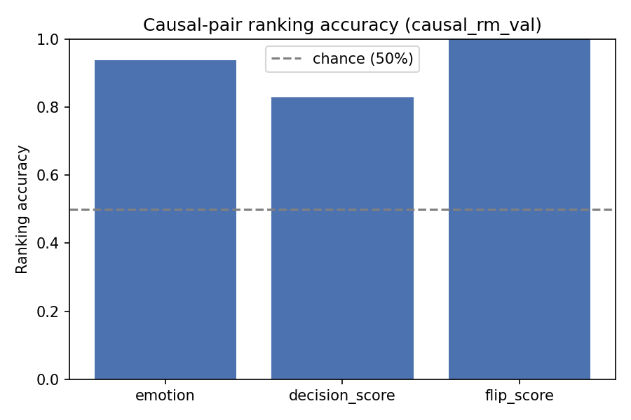
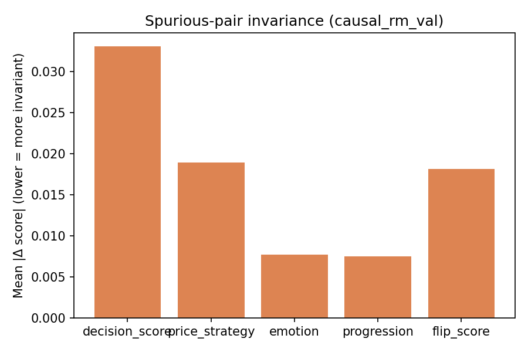

# Causal RM Audit Report — causal_rm_val

Backend: `causal_rm`  |  Split: `val`  |  Checkpoint: `/home/paritosh/priyasmita/Qwen3-tts/v2/causal_rm_experiments/fixed_loss_lambda_inv_1.5_20260801_132810/checkpoint`

## Causal-pair ranking accuracy (chance = 50%)

| Dimension | Accuracy | N pairs |
|---|---:|---:|
| emotion | 0.9381 | 97 |
| decision_score | 0.8300 | 100 |
| flip_score | 1.0000 | 10 |

## Spurious-pair invariance (lower = better)

| Dimension | Mean \|Δ\| | N pairs |
|---|---:|---:|
| decision_score | 0.033084 | 293 |
| price_strategy | 0.018958 | 293 |
| emotion | 0.007735 | 293 |
| progression | 0.007524 | 293 |
| flip_score | 0.018145 | 293 |

