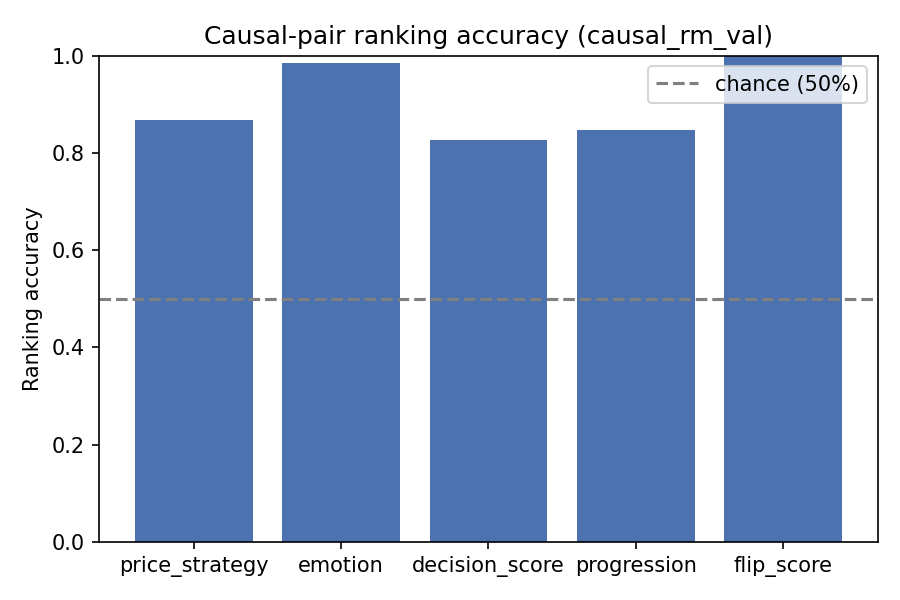
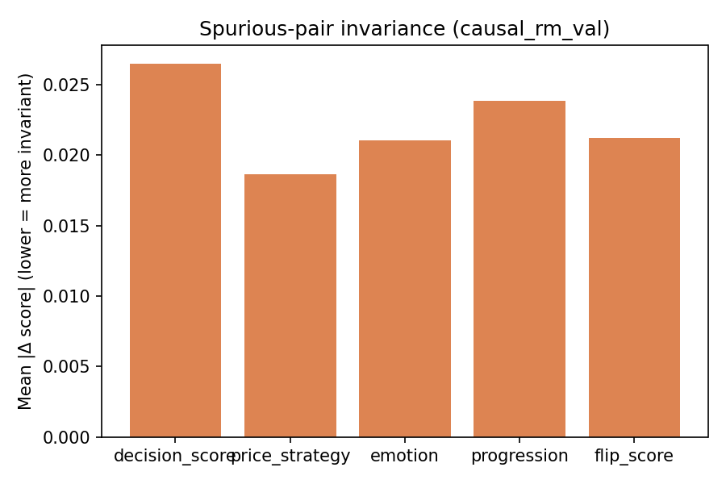

# Causal RM Audit Report — causal_rm_val

Backend: `causal_rm`  |  Split: `val`  |  Checkpoint: `/home/paritosh/priyasmita/Qwen3-tts/v2/causal_rm_experiments/full_coverage_2000pairs_lambda_inv_1.5_20260801_141008/checkpoint`

## Causal-pair ranking accuracy (chance = 50%)

| Dimension | Accuracy | N pairs |
|---|---:|---:|
| price_strategy | 0.8676 | 136 |
| emotion | 0.9866 | 149 |
| decision_score | 0.8280 | 157 |
| progression | 0.8475 | 118 |
| flip_score | 1.0000 | 11 |

## Spurious-pair invariance (lower = better)

| Dimension | Mean \|Δ\| | N pairs |
|---|---:|---:|
| decision_score | 0.026470 | 429 |
| price_strategy | 0.018625 | 429 |
| emotion | 0.021030 | 429 |
| progression | 0.023863 | 429 |
| flip_score | 0.021225 | 429 |

