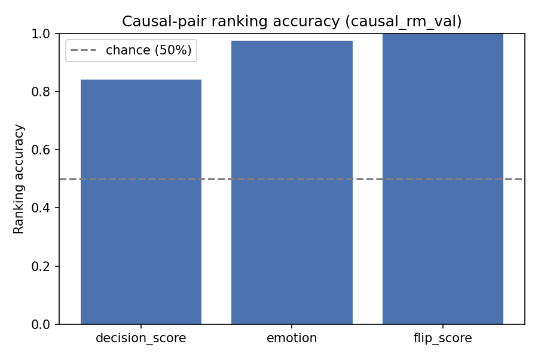
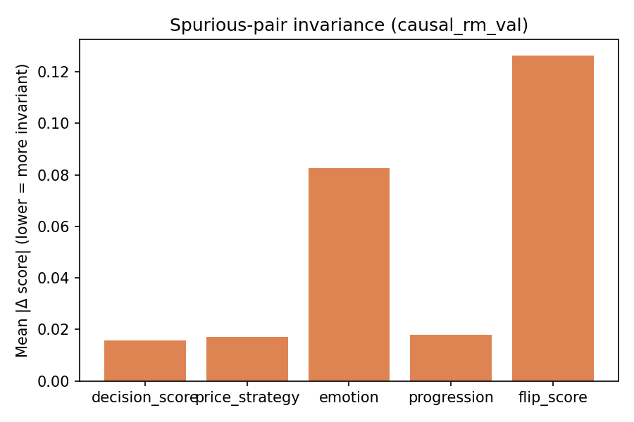

# Causal RM Audit Report — causal_rm_val

Backend: `causal_rm`  |  Split: `val`  |  Checkpoint: `/home/paritosh/priyasmita/Qwen3-tts/v2/causal_rm_experiments/prototype_20260728_164347/checkpoint`

## Causal-pair ranking accuracy (chance = 50%)

| Dimension | Accuracy | N pairs |
|---|---:|---:|
| decision_score | 0.8413 | 1884 |
| emotion | 0.9746 | 1852 |
| flip_score | 1.0000 | 186 |

## Spurious-pair invariance (lower = better)

| Dimension | Mean \|Δ\| | N pairs |
|---|---:|---:|
| decision_score | 0.015835 | 5652 |
| price_strategy | 0.017025 | 5652 |
| emotion | 0.082610 | 5652 |
| progression | 0.017854 | 5652 |
| flip_score | 0.126287 | 5652 |

