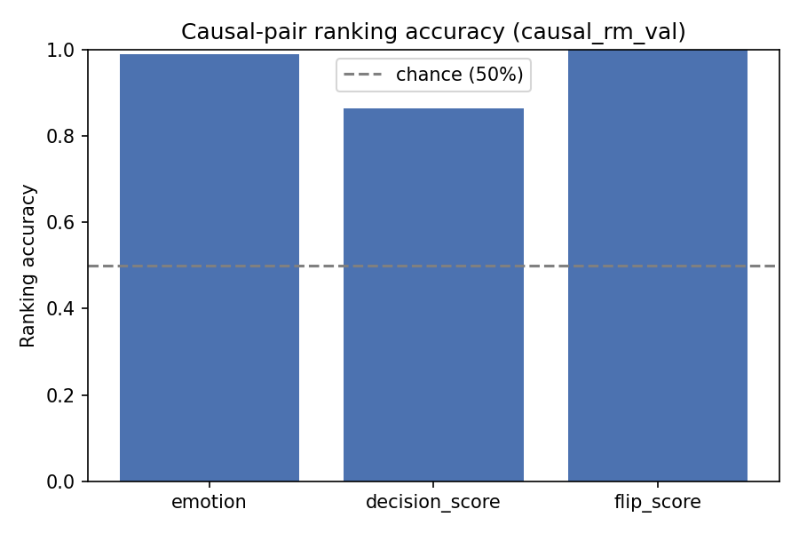
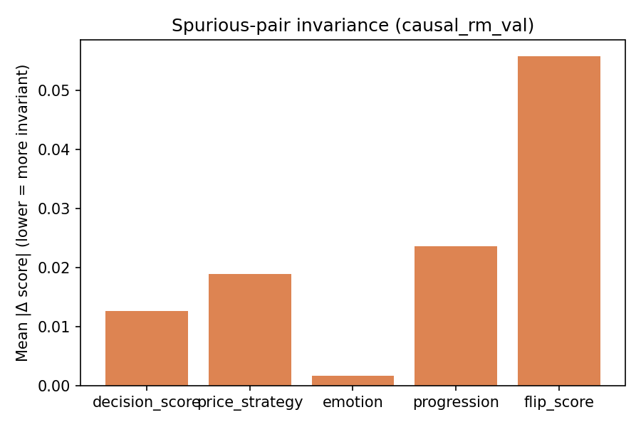

# Causal RM Audit Report — causal_rm_val

Backend: `causal_rm`  |  Split: `val`  |  Checkpoint: `/home/paritosh/priyasmita/Qwen3-tts/v2/causal_rm_experiments/scaleup_2000pairs_lambda_inv_1.5_20260801_133731/checkpoint`

## Causal-pair ranking accuracy (chance = 50%)

| Dimension | Accuracy | N pairs |
|---|---:|---:|
| emotion | 0.9895 | 191 |
| decision_score | 0.8650 | 200 |
| flip_score | 1.0000 | 19 |

## Spurious-pair invariance (lower = better)

| Dimension | Mean \|Δ\| | N pairs |
|---|---:|---:|
| decision_score | 0.012647 | 590 |
| price_strategy | 0.018915 | 590 |
| emotion | 0.001644 | 590 |
| progression | 0.023669 | 590 |
| flip_score | 0.055814 | 590 |

