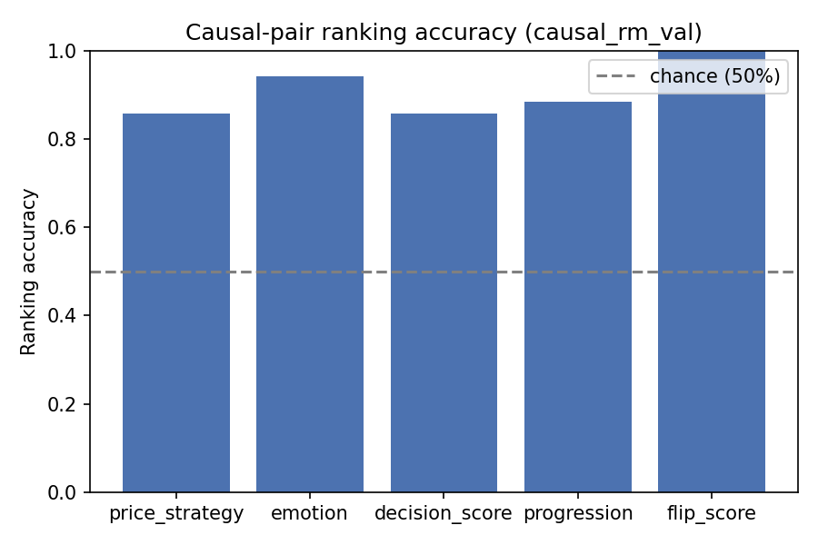
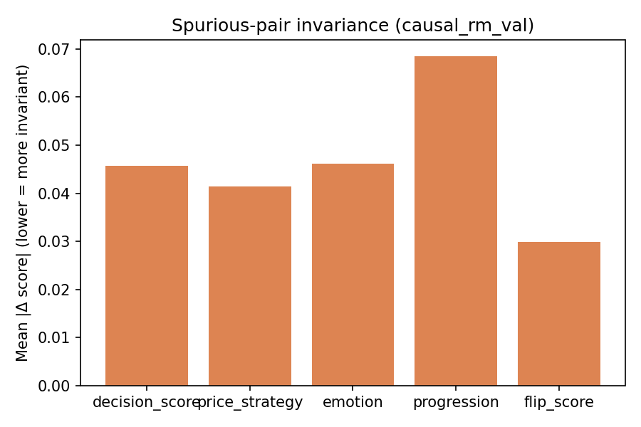

# Causal RM Audit Report — causal_rm_val

Backend: `causal_rm`  |  Split: `val`  |  Checkpoint: `/home/paritosh/priyasmita/Qwen3-tts/v2/causal_rm_experiments/v1_text_only_control_20260816_132813/checkpoint`

## Causal-pair ranking accuracy (chance = 50%)

| Dimension | Accuracy | N pairs |
|---|---:|---:|
| price_strategy | 0.8571 | 42 |
| emotion | 0.9423 | 52 |
| decision_score | 0.8571 | 42 |
| progression | 0.8857 | 35 |
| flip_score | 1.0000 | 2 |

## Spurious-pair invariance (lower = better)

| Dimension | Mean \|Δ\| | N pairs |
|---|---:|---:|
| decision_score | 0.045708 | 127 |
| price_strategy | 0.041376 | 127 |
| emotion | 0.046168 | 127 |
| progression | 0.068489 | 127 |
| flip_score | 0.029903 | 127 |

