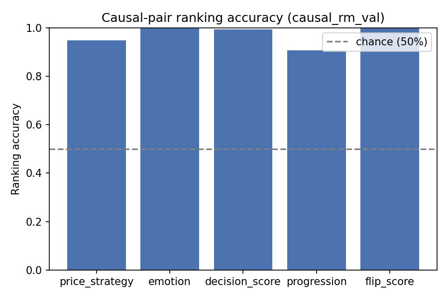
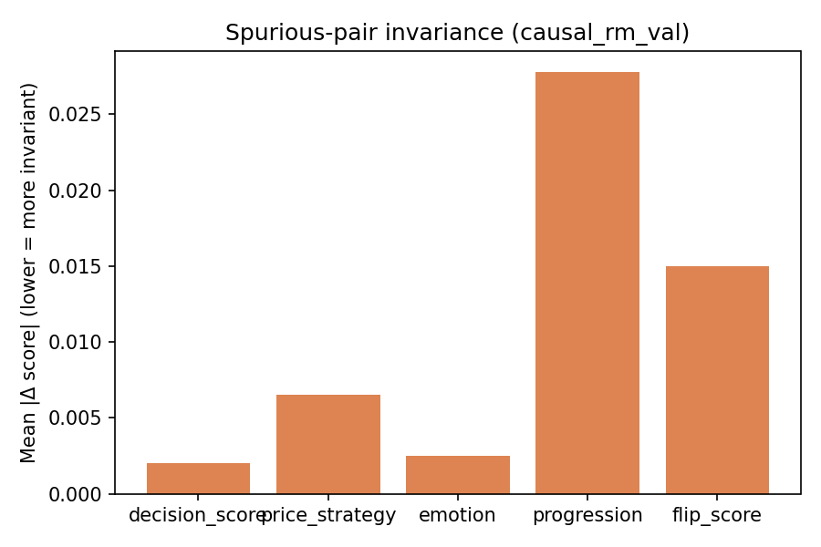

# Causal RM Audit Report — causal_rm_val

Backend: `causal_rm`  |  Split: `val`  |  Checkpoint: `/home/paritosh/priyasmita/Qwen3-tts/v2/causal_rm_experiments/v2_audio_fusion_full_20260816_152709/checkpoint`

## Causal-pair ranking accuracy (chance = 50%)

| Dimension | Accuracy | N pairs |
|---|---:|---:|
| price_strategy | 0.9485 | 136 |
| emotion | 1.0000 | 149 |
| decision_score | 0.9936 | 157 |
| progression | 0.9068 | 118 |
| flip_score | 1.0000 | 11 |

## Spurious-pair invariance (lower = better)

| Dimension | Mean \|Δ\| | N pairs |
|---|---:|---:|
| decision_score | 0.002027 | 429 |
| price_strategy | 0.006508 | 429 |
| emotion | 0.002520 | 429 |
| progression | 0.027784 | 429 |
| flip_score | 0.014972 | 429 |

