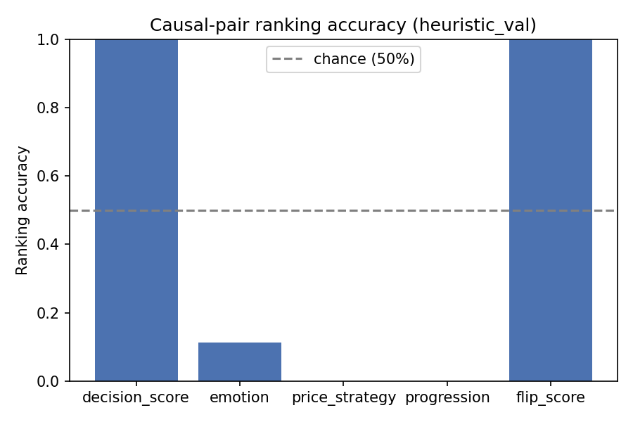
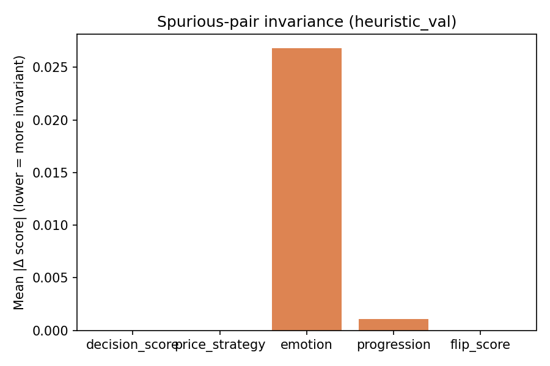

# Causal RM Audit Report — heuristic_val

Backend: `heuristic`  |  Split: `val`  |  Checkpoint: `N/A (heuristic)`

## Causal-pair ranking accuracy (chance = 50%)

| Dimension | Accuracy | N pairs |
|---|---:|---:|
| decision_score | 1.0000 | 1884 |
| emotion | 0.1133 | 1853 |
| price_strategy | 0.0000 | 1884 |
| progression | 0.0000 | 1570 |
| flip_score | 1.0000 | 186 |

## Spurious-pair invariance (lower = better)

| Dimension | Mean \|Δ\| | N pairs |
|---|---:|---:|
| decision_score | 0.000000 | 5652 |
| price_strategy | 0.000000 | 5652 |
| emotion | 0.026805 | 5652 |
| progression | 0.001062 | 5652 |
| flip_score | 0.000000 | 5652 |

